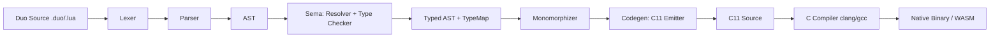

# Design Document: Duo Language Spec

## Overview

Duo is a systems programming language that extends Lua 5.5 with static typing, generics, structured error handling, ARC memory management, cooperative concurrency, and ahead-of-time compilation to C. The compiler is implemented in Zig and follows a traditional multi-pass architecture: source text → tokens → AST → typed AST → C11 source → native binary (or WASM via wasi-sdk).

This design covers the complete language implementation: lexing, parsing (including statement-style calls and `in` disambiguation), type checking (with inference, generics, and concepts), semantic analysis, C code generation (with monomorphization, ARC insertion, async state machines), and the runtime support library.

### Design Goals

- **Lua compatibility**: Every valid Lua 5.5 program is valid Duo — no features removed, only added
- **Zero-cost abstractions**: Generics monomorphize; typed code compiles to direct C with no boxing
- **Predictable performance**: ARC with cycle collector, no GC pauses
- **Shell ergonomics**: Statement-style calls, bare locals, `fun`/`req` aliases
- **Single compilation unit**: Duo → C11 → native/WASM (no intermediate bytecode)

---

## Architecture

### High-Level Pipeline



### Compiler Phases

| Phase | Input | Output | Module |
|-------|-------|--------|--------|
| 1. Lexing | Source text | Token stream | `src/lexer.zig` |
| 2. Parsing | Token stream | Untyped AST | `src/parser.zig` |
| 3. Resolution | AST | Scoped AST (upvalues, globals marked) | `src/sema.zig` |
| 4. Type Checking | Scoped AST | TypeMap (per-expression types) | `src/sema.zig` |
| 5. Monomorphization | Typed AST + generic instantiations | Specialized AST nodes | `src/mono.zig` (new) |
| 6. ARC Insertion | Typed AST | AST with retain/release annotations | `src/arc.zig` (new) |
| 7. Async Lowering | Typed AST | State machine structs | `src/async_lower.zig` (new) |
| 8. C Code Generation | Fully typed/lowered AST | C11 source file | `src/codegen.zig` |
| 9. C Compilation | C11 source | Native binary or WASM | External (clang/zig cc) |

### Mode Selection

The compiler operates in two modes based on file extension:
- `.lua` files: `lua55_mode = true` — implicit `global *`, Lua 5.5 compatibility
- `.duo` files: `duo_mode = true` — bare assignment creates locals, `global` required for module scope

---

## Components and Interfaces

### 1. Lexer (`src/lexer.zig`)

**Responsibility**: Tokenize Duo/Lua source into a stream of `Token` values.

**Key additions to current implementation**:
- `@` token for attributes
- `?` and `!` postfix operators
- `async`, `await`, `match`, `try`, `catch`, `defer`, `enum`, `concept` as contextual keywords (not reserved — only keyword when in declaration position)
- `=>` for match arms
- `->` already supported for return type annotations

```zig
pub const TokenKind = enum {
    // ... existing tokens ...
    // New Duo tokens:
    at,          // @
    question,    // ? (postfix)
    bang,        // ! (postfix)
    fat_arrow,   // =>
    kw_match, kw_try, kw_catch, kw_defer,
    kw_async, kw_await, kw_enum, kw_concept,
};
```

### 2. Parser (`src/parser.zig`)

**Responsibility**: Produce an AST from a token stream, handling Duo's extended grammar including statement-style calls, `in` operator disambiguation, and optional `then`.

**Statement-Style Call Algorithm**:

```
parse_expr_stmt():
  expr = parse_suffixed_expr()
  if expr is Name AND next_token is {string_lit, int_lit, float_lit, name}:
    // Statement-style call: f arg1, arg2, ...
    args = [parse_expr()]
    while peek() in {comma}:
      advance()  // consume comma
      args.append(parse_expr())
    // Terminate at: newline, semicolon, end, else, elseif, until, eof
    return CallStmt(func=expr, args=args)
```

**`in` Disambiguation Rule**:
- After a `for` header's variable list, `in` is ALWAYS the loop keyword
- Everywhere else, `in` is a binary operator invoking `__contains`

```
parse_for():
  vars = parse_name_list()
  if peek() == kw_in:  // always loop-for after variable list
    ...
  else:  // numeric for
    ...

parse_prec(min_prec):
  // 'in' treated as binary operator with precedence between comparison and bitwise
  if tok == kw_in: { .op = .contains, .left = 5, .right = 5 }
```

### 3. AST (`src/ast.zig`)

**No `struct` keyword.** Duo follows Lua's philosophy: all composite data is a table. There is no `struct`, no `class`, no explicit record declaration. To give a table a typed shape, the user annotates the binding's type with a **table type literal** `{ field: T, field: U, ... }` (a.k.a. inline record type). The Type_Checker treats the literal as a structural type — equivalence is by shape, not by name.

```zig
// Typed record via type-literal annotation
local Point: { x: f64, y: f64 } = { x = 1.0, y = 2.0 }

// A table literal annotated with @implements(Concept) declares a value
// whose runtime type is tagged with that concept (sets `__concepts`).
@implements(Iterable)
local my_iter: { __iter: () -> any } = { __iter = function() ... end }
```

**New AST nodes required**:

```zig
pub const Stmt = union(enum) {
    // ... existing ...
    match_stmt: MatchExpr,
    try_stmt: TryStmt,
    defer_stmt: DeferStmt,
    enum_def: EnumDef,
    concept_def: ConceptDef,
    // NOTE: there is no `struct_def` variant. Records are expressed as
    // typed table literals (`@implements(C) local x: { ... } = { ... }`).
};

pub const MatchExpr = struct {
    loc: Loc,
    scrutinee: *Expr,
    arms: []MatchArm,
};

pub const MatchArm = struct {
    pattern: Pattern,
    guard: ?*Expr,
    body: Block,
};

pub const Pattern = union(enum) {
    literal: *Expr,
    binding: struct { name: []const u8, typ: ?TypeExpr },
    variant: struct { tag: []const u8, payload: ?[]Pattern },
    table_destr: []struct { key: []const u8, pat: Pattern },
    array_destr: []Pattern,
    rest: []const u8,  // ...name
    wildcard,          // _
};

pub const DeferStmt = struct {
    loc: Loc,
    body: Block,
};

pub const TryStmt = struct {
    loc: Loc,
    body: Block,
    catches: []CatchClause,
    defers: []DeferStmt,
};

/// A catch clause always binds the caught error to a single name. There is
/// no typed `catch MyError e` form — errors are table values and any caller-
/// supplied `__tag` check is performed inside the body with `match` / `if`.
pub const CatchClause = struct {
    loc: Loc,
    binding: ?[]const u8,
    body: Block,
};

pub const EnumDef = struct {
    loc: Loc,
    name: []const u8,
    type_params: ?[]TypeExpr,
    variants: []EnumVariant,
    attributes: []Attribute,
};

pub const EnumVariant = struct {
    name: []const u8,
    payload: ?[]struct { name: ?[]const u8, typ: TypeExpr },
};

pub const Attribute = struct {
    name: []const u8,
    args: ?[]const u8,  // raw string for now; parsed by sema
};

pub const ConceptDef = struct {
    loc: Loc,
    name: []const u8,
    type_params: ?[]TypeExpr,
    required_methods: []FuncSignature,
    required_fields: []struct { name: []const u8, typ: TypeExpr },
};
```

**Extended Expr for Duo operators**:

```zig
pub const Expr = union(enum) {
    // ... existing ...
    try_expr: struct { loc: Loc, operand: *Expr },       // expr?
    unwrap_expr: struct { loc: Loc, operand: *Expr },    // expr!
    match_expr: *MatchExpr,
    await_expr: struct { loc: Loc, operand: *Expr },
    contains_expr: struct { loc: Loc, lhs: *Expr, rhs: *Expr }, // x in y
};
```

### 4. Type System (`src/types.zig`)

**Extended `ResolvedType`**:

```zig
pub const ResolvedType = union(enum) {
    // ... existing primitives ...

    // New Duo types:
    result: struct { ok: *ResolvedType, err: *ResolvedType },
    option: *ResolvedType,
    enum_type: struct { name: []const u8, variants: []EnumVariantType },
    channel: struct { elem: *ResolvedType, capacity: ?usize },
    generic_param: struct { name: []const u8, constraint: ?[]const u8 },
    // Inline record type — structural, no name. Equivalent to a Lua table
    // whose fields have been declared via a type-literal annotation. The
    // Codegen lowers this to a C `struct` of the same shape.
    table_type: struct { fields: []FieldType },

    // Type constructors for generics:
    instantiated: struct {
        base: *ResolvedType,
        args: []ResolvedType,
        specialization_key: u64,  // __generic_id / __typekey
    },
};
```

**Records are anonymous by design.** A binding annotated with
`local p: { x: f64, y: f64 } = { x = 1.0, y = 2.0 }` produces a value of
`table_type` whose fields are the declared keys. Two record types are equal
iff their field sets are equal (structural typing, with field names mattering).
There is no syntax to *name* a record type — pass it around as a function
parameter annotation, or alias it via a type-parameter binding.

**Concept Registry** (within Sema):

```zig
pub const ConceptInfo = struct {
    name: []const u8,
    required_methods: []struct {
        name: []const u8,
        signature: ResolvedType,  // func type
    },
    required_fields: []struct {
        name: []const u8,
        typ: ResolvedType,
    },
};
```

### 5. Semantic Analysis (`src/sema.zig`)

**New responsibilities**:

1. **Scope resolution with Duo semantics**:
   - In `.duo` mode: bare assignment at new-binding position → local; `local x = ...` also accepted (Lua compat)
   - `global x = ...` → module-global
   - `let` is NOT a keyword — treated as identifier

2. **Type inference engine**:
   - Bottom-up expression typing (already partially implemented)
   - Generic instantiation tracking
   - Concept satisfaction checking

5. **Concept satisfaction via attribute**:
   - A binding annotated with `@implements(Concept1, Concept2, ...)` declares
     that its (table) value satisfies one or more concepts. There is no
     `struct ... implements C ...` form. The Sema resolves the annotated
     binding's table-type literal against each concept's required members
     and emits an error if any are missing.
   - At runtime, the concept tags are stamped onto the table's metatable so
     that `__concepts()` returns the list.

3. **Exhaustiveness checker** (for match):
   - Tracks which variants are covered
   - Reports missing cases with names

4. **Result-compatibility analysis**:
   - Any type with `__try` metamethod is result-compatible
   - `?` operator requires enclosing function to have result-compatible return type
   - `!` operator rejected in `@nopanic` functions

### 6. Monomorphizer (`src/mono.zig` — new)

**Responsibility**: Expand generic functions/types into concrete specializations.

**Algorithm**:
1. Walk the typed AST collecting instantiation sites
2. For each unique `(generic_def, type_args)` pair, generate a specialized copy
3. Use `__generic_id`/`__typekey` as stable cache keys
4. If `__specialize` is defined, invoke it to customize instantiation
5. Repeat until no new instantiations are discovered (fixed-point)

```zig
pub const Monomorphizer = struct {
    specializations: std.HashMap(SpecKey, *ast.FuncBody),
    work_queue: std.ArrayList(SpecRequest),

    pub const SpecKey = struct {
        generic_id: u64,
        type_args_hash: u64,
    };

    pub fn run(self: *Monomorphizer, module: *ast.Module) !void {
        // Iterative fixed-point expansion
        while (self.work_queue.items.len > 0) {
            const req = self.work_queue.pop();
            const specialized = try self.specialize(req);
            // Scan specialized body for new instantiation sites
            try self.scan_for_instantiations(specialized);
        }
    }
};
```

### 7. ARC Insertion (`src/arc.zig` — new)

**Responsibility**: Insert reference-counting operations into the typed AST.

**Strategy**:
- **Primitive types** (int, float, bool): no ARC needed
- **Heap types** (tables, closures, strings, enum payloads): ARC managed
- **`@arc(false)` types**: stack-allocated, no refcounting
- **FFI-boundary values**: no refcounting (caller manages)

**Operations inserted**:
- `duo_retain(ptr)` at assignment/capture sites
- `duo_release(ptr)` at scope exit, reassignment, and drop points
- `duo_close(ptr)` before `duo_release` when `__close` is defined

**Cycle Collector Integration**:
- Objects that could form cycles (tables with table-valued fields) get registered with the cycle collector
- Cycle collector runs incrementally (configurable threshold, default 1ms budget per invocation)

### 8. Async Lowering (`src/async_lower.zig` — new)

**Responsibility**: Transform `async` functions into stackless state machines.

**Generated C structure per async function**:

```c
typedef struct {
    int state;              // current resume point
    duo_TaskResult result;  // final value or error
    // Captured locals preserved across await points:
    int64_t local_0;
    const char* local_1;
    // ...
} duo_async_frame_MyFunc;

static duo_PollResult duo_async_step_MyFunc(duo_async_frame_MyFunc* frame) {
    switch (frame->state) {
    case 0:
        // code before first await
        frame->state = 1;
        return DUO_POLL_PENDING;
    case 1:
        // code after first await resumes here
        frame->state = 2;
        return DUO_POLL_READY;
    }
}
```

**Scheduler** (in runtime):
- Default: cooperative single-threaded event loop polling ready tasks
- `@concurrent("threaded")` or `--threads`: work-stealing thread pool
- WASM + threads = compile error (Requirement 25.4)

### 9. Code Generator (`src/codegen.zig`)

**Extensions to current implementation**:

1. **Monomorphized generics**: Emit one C function per specialization with mangled name (`duo_Vec_i32_push`, `duo_Vec_str_push`)

2. **Defer lowering**: At every scope exit (return, error, break), emit deferred blocks in LIFO order

3. **ARC emit**: Insert `duo_retain`/`duo_release` calls based on ARC annotations

4. **Async state machines**: Emit frame structs and step functions

5. **Match compilation**: Decision tree → nested if/switch in C

6. **Closure representation**:
```c
typedef struct {
    duo_refcount_t rc;
    duo_FuncPtr fn;
    // Captured variables:
    int64_t* upval_0;
    const char** upval_1;
} duo_closure_N;
```

7. **Enum representation**:
```c
typedef struct {
    int tag;
    union {
        struct { int64_t val; } Variant_A;
        struct { const char* msg; int code; } Variant_B;
    } data;
} duo_MyEnum;
```

8. **Anonymous record (table-type literal) representation**:
   - When a binding is annotated with a `{ field: T, ... }` type, the Codegen
     mints a fresh C `struct` (no name conflict because records are anonymous
     and inline), embeds it inside the function's scope, and uses it as the
     binding's storage.
   - Two structurally-equivalent records get distinct C struct declarations;
     Codegen deduplicates by content hash to keep the generated C small.
   - Field accesses compile to plain `struct.field` reads/writes — no
     hashtable lookup, no `__index` chain, fully native speed.
   - If a record value is assigned to a generic `table` parameter, the value
     gets promoted to a `duo_Table*` and ARC takes over.

```c
// local p: { x: f64, y: f64 } = { x = 1.0, y = 2.0 }
struct __anon_record_0 { double x; double y; };
struct __anon_record_0 p = { .x = 1.0, .y = 2.0 };
```

### 10. Runtime Library (`src/runtime/`)

**Components**:

| File | Responsibility |
|------|---------------|
| `runtime/arc.h` | Reference counting macros, cycle collector |
| `runtime/scheduler.h` | Task scheduler (single-threaded + thread pool) |
| `runtime/channel.h` | Typed bounded channels |
| `runtime/value.h` | Dynamic `lua_Value` representation |
| `runtime/table.h` | Table/metatable operations |
| `runtime/string.h` | Immutable string with interning |
| `runtime/error.h` | Error types, panic, try/catch support |
| `runtime/modules/` | Standard library modules (fs, path, net, json, etc.) |

---

## Data Models

### Type Representation in Generated C

| Duo Type | C Representation |
|----------|-----------------|
| `int` / `i64` | `int64_t` |
| `float` / `f64` | `double` |
| `bool` | `bool` |
| `str` | `const char*` (ARC-managed immutable) |
| `nil` | `void*` (NULL) |
| `any` | `lua_Value` (tagged union) |
| `Table` | `duo_Table*` (ARC-managed) |
| `Closure` | `duo_Closure*` (ARC-managed) |
| `Result[T, E]` | `duo_Result_T_E` (struct with tag + union) |
| `Option[T]` | `duo_Option_T` (struct with tag + value) |
| `Channel[T]` | `duo_Channel_T*` (ARC-managed, thread-safe when threaded) |
| `enum MyEnum` | Tagged union struct |
| Anonymous record `{ x: f64, y: f64 }` | Inline C struct with the declared fields; ARC-managed when stored in a table, by-value when stored as a `local` |
| Generic `Vec[T]` | `duo_Vec_T` per monomorphization |

### ARC Object Layout

```c
// Every ARC-managed heap object has this header
typedef struct {
    uint32_t refcount;      // strong reference count
    uint16_t flags;         // GC color for cycle collector, __close bit
    uint16_t type_tag;      // for runtime type dispatch
} duo_ObjHeader;

// Example: ARC-managed string
typedef struct {
    duo_ObjHeader header;
    uint32_t len;
    uint32_t hash;          // cached hash for table keys
    char data[];            // flexible array member
} duo_String;
```

### Scheduler State

```c
typedef struct {
    duo_Task* ready_queue;      // runnable tasks
    duo_Task* suspended_queue;  // awaiting I/O or channel
    uint32_t task_count;
    bool threaded;              // false = single-threaded cooperative
    // Thread pool (only when threaded=true):
    pthread_t* workers;
    uint32_t worker_count;
    duo_WorkStealingDeque* deques;  // per-worker
} duo_Scheduler;

typedef struct duo_Task {
    void* frame;                // async frame pointer
    duo_PollFn step_fn;         // state machine step function
    duo_TaskStatus status;      // ready, suspended, completed, cancelled
    struct duo_Task* next;      // intrusive list
    duo_DeferStack defers;      // pending defers for cancellation cleanup
} duo_Task;
```

### Module Resolution Table

```c
// Built at program startup
typedef struct {
    const char* name;
    duo_ModuleInitFn init_fn;
    lua_Value cached_exports;
} duo_ModuleEntry;
```

---

## Correctness Properties

*A property is a characteristic or behavior that should hold true across all valid executions of a system — essentially, a formal statement about what the system should do. Properties serve as the bridge between human-readable specifications and machine-verifiable correctness guarantees.*

### Property 1: Parser Round-Trip

*For any* valid Duo abstract syntax tree, pretty-printing it to source text and then parsing that source text SHALL produce an equivalent AST.

**Validates: Requirements 23.11, 23.12**

### Property 2: Statement-Style Call Equivalence

*For any* valid function name and argument list `(a1, a2, ..., aN)`, the statement-style form `f a1, a2, ..., aN` SHALL parse to an AST identical to the parenthesized form `f(a1, a2, ..., aN)`.

**Validates: Requirements 2.1, 2.2**

### Property 3: Scoping Invariant

*For any* valid identifier in a `.duo` file, bare assignment at a new-binding position SHALL create a local-scoped binding, and the same identifier preceded by `global` SHALL create a module-global-scoped binding. The two scoping mechanisms are mutually exclusive and exhaustive.

**Validates: Requirements 1.3, 1.4**

### Property 4: Type Annotation Enforcement

*For any* variable declaration with an explicit type annotation `T` and initializer expression of type `U` where `T ≠ U` and no implicit coercion exists, the Type_Checker SHALL emit a type error. Conversely, for any call site where argument types match parameter annotations, the Type_Checker SHALL accept the call.

**Validates: Requirements 3.1, 3.4**

### Property 5: Type Inference Soundness

*For any* expression with a statically determinable type, if no type annotation is provided, the inferred type SHALL equal the expression's actual type. Specifically: integer literals → `i64`, float literals → `f64`, string literals → `str`, boolean literals → `bool`, and function calls → the function's declared return type.

**Validates: Requirements 3.2, 3.5**

### Property 6: Monomorphization Uniqueness

*For any* generic function or type instantiated with distinct type argument tuples, the Compiler SHALL produce distinct C specializations. Instantiation with identical type arguments SHALL reuse the same specialization.

**Validates: Requirements 4.1, 4.3**

### Property 7: Match Exhaustiveness

*For any* enum type with N variant cases and a match expression covering fewer than N cases without a wildcard arm, the Type_Checker SHALL emit a compile-time error listing the uncovered variants.

**Validates: Requirements 5.5, 6.2**

### Property 8: Defer LIFO Ordering

*For any* scope containing N `defer` statements declared in order D1, D2, ..., DN, when the scope exits (normally or via error), the deferred blocks SHALL execute in order DN, DN-1, ..., D1.

**Validates: Requirements 8.4, 8.5**

### Property 9: Result Operator Semantics

*For any* result-compatible value `v` (implementing `__try`): if `v` represents success with value `x`, then `v?` SHALL evaluate to `x`; if `v` represents an error `e`, then `v?` SHALL propagate `e` to the enclosing function's return. The `?` operator SHALL only be accepted by the Type_Checker when the enclosing function's return type is itself result-compatible.

**Validates: Requirements 9.1, 9.2, 9.3, 9.7**

### Property 10: Closure Shared Capture

*For any* variable `x` captured by a closure, mutations to `x` in the enclosing scope after closure creation SHALL be visible when reading `x` through the closure, and vice versa. The captured variable SHALL remain alive (via ARC) as long as any closure referencing it exists.

**Validates: Requirements 10.2, 10.3, 10.4**

### Property 11: Codegen Produces Valid C

*For any* fully-typed Duo module (all functions annotated, no `any` fallbacks), the generated C11 source SHALL compile without errors under `clang -Wall -Wextra -pedantic -std=c11`.

**Validates: Requirements 24.1, 24.6**

### Property 12: Bitwise Operation Correctness

*For any* pair of integer values `a` and `b`, the Duo bitwise operations `a & b`, `a | b`, `a ~ b` (xor), `~a` (not), `a << b`, `a >> b` SHALL produce results identical to the corresponding C operations on `int64_t` values.

**Validates: Requirements 13.1, 13.2, 13.3**

### Property 13: ARC Refcount Correctness

*For any* sequence of assignments and scope exits involving an ARC-managed value, the reference count SHALL reach zero if and only if no live reference to the value exists, and reaching zero SHALL trigger immediate deallocation.

**Validates: Requirements 26.1, 26.2**

### Property 14: Concept Constraint Checking

*For any* type `T` and concept `C` with required members `{m1, m2, ...}`, the Type_Checker SHALL accept `T` satisfying `C` if and only if `T` provides all required members with compatible signatures.

**Validates: Requirements 15.1, 15.2, 15.4**

### Property 15: `in` Operator Disambiguation

*For any* occurrence of the token `in`: when it appears after a `for` header's variable list it SHALL be parsed as the loop keyword; in all other expression contexts it SHALL be parsed as a binary operator invoking `__contains`.

**Validates: Requirements 23.10**

---

## Error Handling

### Compile-Time Errors

| Error Category | Triggered By | Diagnostic Content |
|---------------|-------------|-------------------|
| Type mismatch | Assignment/call with wrong types | Expected type, actual type, source location |
| Exhaustiveness | Incomplete match | Enum name, missing variant names |
| Constraint violation | Generic instantiation fails concept | Concept name, failing type, missing members |
| Overload ambiguity | Multiple equally-good matches | All candidate signatures |
| `?` in non-result function | Using `?` where return isn't result-compatible | Function name, return type, suggestion |
| `!` in `@nopanic` | Using `!` in nopanic-annotated function | Function name, attribute location |
| WASM + threads | `--threads` or `@concurrent("threaded")` with wasm target | Clear message: "multi-threaded mode not supported on wasm32-wasi" |
| Circular import | Module A → B → A | Full cycle path |

### Runtime Errors

| Error Category | Mechanism | Behavior |
|---------------|-----------|----------|
| Panic (`!` on error) | `duo_panic(msg)` | Print message + stack trace, exit(1) |
| Uncaught error in async | Propagated to `await` site | Returns error result |
| Channel closed | Send/receive on closed channel | Returns error result |
| Stack overflow | Recursion depth limit | Panic with "stack overflow" |
| Division by zero | Integer division | Panic |
| Nil dereference | Field/index on nil | Panic with location |

### Error Propagation Model

```
Function with Result return type:
  1. Error raised → check for matching catch clause
  2. No catch match → execute defers in LIFO order
  3. Return error to caller
  4. Caller uses ? to propagate or ! to unwrap

Function without Result return type:
  1. Error raised → check for matching catch clause
  2. No catch match → panic (unhandled error)
```

---

## Testing Strategy

### Property-Based Testing

**Library**: [zig-check](https://github.com/ziglang/zig) built-in fuzz testing OR a custom PBT harness using Zig's `std.Random` for generation with minimum 100 iterations per property.

**Configuration**:
- Minimum 100 iterations per property test
- Each property test references its design document property
- Tag format: `Feature: duo-language-spec, Property {N}: {title}`

### Property Tests

| Property | Generator Strategy |
|----------|-------------------|
| P1: Round-trip | Generate random valid ASTs, pretty-print → parse → compare |
| P2: Statement-style equivalence | Generate random (name, arg-list) pairs |
| P3: Scoping invariant | Generate identifiers + assignment contexts |
| P4: Type annotation enforcement | Generate (type, value) pairs with known compatibility |
| P5: Type inference | Generate typed expressions without annotations |
| P6: Monomorphization | Generate generic funcs with various type arg combinations |
| P7: Exhaustiveness | Generate enums with N variants and partial matches |
| P8: Defer ordering | Generate scopes with 1-10 defers |
| P9: Result operators | Generate result values (success/error) and ? applications |
| P10: Closure capture | Generate nested functions with mutations |
| P11: Valid C output | Generate fully-typed modules, compile generated C |
| P12: Bitwise ops | Generate random i64 pairs, compare Duo vs C |
| P13: ARC correctness | Generate allocation/deallocation sequences |
| P14: Concept checking | Generate types and concepts with varying member sets |
| P15: `in` disambiguation | Generate for-loops and expression contexts with `in` |

### Unit Tests (Example-Based)

- Keyword aliases: `fun` = `function`, `req` = `require`
- `let` as identifier (not keyword)
- Statement-style nesting: `f g x` = `f(g(x))`
- Binary operator terminates argument list: `f a & b` = `(f(a)) & b`
- Postfix binding: `f x?` binds `?` to `x`
- `@nopanic` + `!` → compile error
- Specific metamethod invocations
- WASM + threads → compile error
- Each attribute's C output

### Integration Tests

- Full compile-and-run tests for example programs
- WASM target validation with wasmtime
- Cross-language benchmark suite (Duo vs C vs Lua vs LuaJIT)
- Cycle collector stress test
- Multi-threaded channel safety

### Existing Test Infrastructure

The project uses:
- `zig build test` — runs both compile-fail tests (bash script) and Zig unit tests
- `zig build unit-test` — Zig unit tests only (lexer, parser, AST, types, sema)
- `zig build bench` — performance benchmarks
- `tests/` directory with `.lua` test files and compile-fail scripts

New property tests should be added to `src/tests.zig` or a dedicated `src/property_tests.zig` file, using Zig's built-in test framework with random generation.
