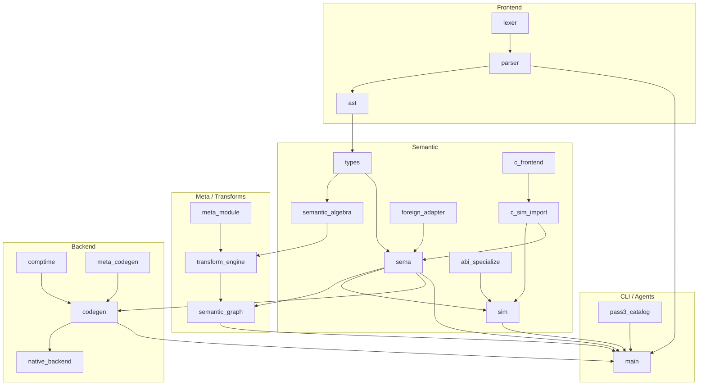

# Pass 6 — Architectural Reconciliation, Dependency Audit, and Convergence

**Status:** Phase 0 audit **partial** (2026-08-04)  
**Principle:** Reduce total conceptual complexity — no new language features  
**Catalog:** `duo catalog` → `pass6` via `src/pass6_catalog.zig`  
**Companion:** [`docs/catalogs/convergence.md`](../catalogs/convergence.md), [`docs/catalogs/rejected_ideas.md`](../catalogs/rejected_ideas.md)

Passes 1–5 established identity, convergence algebras, grammar/directives, native backends, and SIM. **Pass 6 integrates** them against repository truth.

> Repository implementation always overrides architecture documents.

---

## Executive Summary

### Largest architectural risks

| Risk | Why it matters |
| --- | --- |
| **codegen monolith + fragmented transform dispatch** (`AR-001`, `AR-002`) | Registry exists in `transform_engine.zig` but tier-1 combinators still dispatch via `fold_meta_string_expr`, `comptimeMetaHook`, and `maybe_emit_meta_*` in `codegen.zig` (~28k lines). Highest drift surface. |
| **Dual semantic JSON formats** (`AR-003`) | `duo graph` (internal graph) vs `duo sim` (SIM v0) without enforced projection pipeline. Agents may pick the wrong surface. |
| **Persistent boxing on typed paths** (`AR-004`) | `pass4_boxed_inventory`: 1870 `lua_Value` refs, 66 `lua_invoke` in `codegen.zig`. Violates AGENTS.md non-negotiable. |
| **Foreign mechanism sprawl** (`DUP-002`, `DUP-003`) | Three lanes: `@c.import`→SIM, `@foreign` text transpile, `@ffi_gen` clang preprocess — overlapping "foreign" vocabulary. |

### Largest simplification opportunities

1. **Single transform apply path** — All `@comp.*` through `transform_engine` + provenance; retire parallel fold tables (P6-07).
2. **SIM as sole agent interchange** — Graph lift internal; MCP/LSP never invent parallel schemas (P6-11, Pass 5 tail).
3. **Knowledge lattice unification** — Replace scattered `native_scalar_mode` checks with `KnowledgeLevel` + `callTransformEligible` (P6-06; `moduleNeedsLuaRuntime` now uses `moduleUsesFullNativeLowering`).
4. **C frontend consolidation** — One bounded parser (`c_frontend.zig`) for `@ffi_gen` and Pass 5 import (DUP-002).
5. **SIM export pipeline** — `sim_pipeline.exportInterchangeSnapshot` canonical path for `duo sim` (P6-11).

### Highest-leverage convergence (ranked)

1. P6-07 Transform dispatch migration (blocks predictable `@comp.*` + agent reasoning)
2. P6-06 Knowledge lattice → codegen gates (blocks native perf convergence)
3. P6-03 Source-of-truth table enforcement in docs + MCP (blocks agent drift)
4. Pass 5 MCP/LSP completion on SIM (blocks cross-language harness)
5. P6-09 Boxing inventory burn-down with invariant tests (blocks Pass 4 completion)

---

## Convergence Matrix

| Subsystem | Owner | Depends on | Consumers | Merge opportunity | Status |
| --- | --- | --- | --- | --- | --- |
| Lexer/Parser | `lexer.zig`, `parser.zig` | — | sema, pretty | `legacy_directives` → `meta_module` only | partial |
| AST | `ast.zig` | lexer | sema, codegen, sim export | — | stable |
| Types / descriptors | `types.zig`, `sema.zig` | ast | codegen, sim, graph | enum/concept/alias → descriptor algebra | partial |
| Knowledge lattice | `semantic_algebra.zig` | types | transform_engine, codegen, dynamic_boundary | absorb StorageClass checks | partial |
| Shape algebra | `semantic_algebra.zig` | types | graph, sim | table_shape_id unified | partial |
| Call algebra | `semantic_algebra.zig` | sema types | codegen, graph | `call.specialize` vs `abi.specialize` documented lanes | partial |
| Transform registry | `transform_engine.zig` | semantic_algebra, meta_module | codegen (partial), catalog | **merge all combinator dispatch here** | open |
| Semantic graph | `semantic_graph.zig` | sema, transforms | `duo graph`, agents | project → SIM, not duplicate | partial |
| SIM v0 | `sim.zig` | sema, types | MCP, LSP, foreign import | **canonical external boundary** | partial |
| C import stack | `c_frontend` → `c_sim_import` → `abi_specialize` → `foreign_adapter` | sim | sema, codegen | merge `c_header_parse` | partial |
| Codegen / C backend | `codegen.zig` | sema, comptime, meta_codegen | clang, runtime | split by concern; thin emit layer | debt |
| Native backend | `native_backend.zig` | types, codegen patterns | P4-M1, direct object | share ABI facts with SIM | partial |
| Runtime | generated C preamble | codegen | all binaries | pay-for-use modules (P4-09) | partial |
| MCP | `duo-mcp/duo_shared.duo` | CLI (`duo sim`, `duo catalog`) | agents | no scrape-only semantic tools | partial |
| LSP | `duo-lsp/src/server.duo` | duo CLI, (target: SIM) | editors | replace regex symbols with SIM queries | partial |
| Catalogs | `pass3_catalog` … `pass6_catalog` | all passes | `duo catalog` | single JSON root | partial |

---

## Duplication Matrix

See `duo catalog` → `pass6.duplications` for machine-readable rows (`DUP-001` … `DUP-008`).

| ID | Concept | Canonical owner | Migration | Priority |
| --- | --- | --- | --- | --- |
| DUP-001 | Semantic export JSON | SIM external; graph internal | Graph → SIM projection API | P1 |
| DUP-002 | C header parsing | `c_frontend.zig` | `@ffi_gen` uses same frontend | P2 |
| DUP-003 | Foreign import | Pass 5 SIM pipeline | Document `@foreign` as separate | P1 |
| DUP-004 | Transform dispatch | `transform_engine.zig` | Gate codegen hooks | **P0** |
| DUP-005 | Directive registry | `meta_module` + pass3 catalog | Remove parser duplicate tables | P1 |
| DUP-006 | Native eligibility knowledge | `KnowledgeLevel` | Codegen reads lattice | **P0** |
| DUP-007 | Agent semantic queries | `duo sim` + `duo catalog` | MCP wraps CLI; LSP uses SIM | P1 |
| DUP-008 | Specialize lanes | call / abi / mono | Document; no fourth path | P2 |

---

## Compiler Dependency DAG

Architectural layers (detail in `pass6.dependency_dag`):



**Cycles to avoid:** `codegen` must not define semantic facts consumed by `sema`. Current risk: meta fold logic in codegen interprets combinator semantics — invert to transform_engine applying typed rewrites.

**Coupling hotspots:** `codegen.zig` imports sema/types/comptime/meta_codegen; `sema.zig` now imports Pass 5 modules (acceptable leaf: foreign import).

---

## Canonical Glossary

| Term | Canonical meaning | Not synonymous with |
| --- | --- | --- |
| **Descriptor** | Compile-time type/concept definition (`types.ResolvedType`, `@{}`, concepts) | JSON schema, runtime table |
| **Shape** | Structural identity of records/enums (`table_type`, `shape_id`) | C layout, SIM entity alone |
| **Knowledge level** | Compiler epistemic state (`observed` … `native`) | `const`, `static`, sealed keyword |
| **Storage class** | Representation policy (`native`, `sealed`, `dynamic`, …) | Knowledge level (bridged, not identical) |
| **Transform** | Registered rewrite with contract (`transform_engine.Descriptor`) | Optimizer pass, arbitrary fold |
| **Semantic graph** | Mutable internal lift (`SemanticGraph`) | SIM, AST |
| **SIM** | Versioned interchange snapshot (`sim-v0`) | Graph JSON, MCP-only record |
| **Foreign descriptor** | Compiler `ResolvedType` + FFI name from SIM (`foreign_adapter`) | `@foreign` snippet |
| **Stage** | Pipeline phase (parse→sema→transform→lower→link) | `@comp.compile.only` alone |
| **Native path** | Lowers to C scalars/structs without `lua_Value` | `native_scalar_mode` flag alone |
| **Direct backend** | Object emission via `native_backend.zig` | C backend always |
| **Provenance** | Transform application log (`transform_engine` provenance) | Debug trace |
| **Parity site** | G-061 eval context (top-level, nested callback, block body) | Single unit test |
| **Interchange** | SIM export/import | Universal AST |

---

## Canonical Source-of-Truth Table

| Concept | Single owner | Query surface |
| --- | --- | --- |
| Grammar (surface) | `docs/GRAMMAR_SPEC.md` + `parser.zig` | `duo_grammar_spec_read` MCP |
| Keywords | `docs/catalogs/keywords.md` + lexer | `duo catalog` |
| `@comp.*` directives | `meta_module.zig` + `docs/catalogs/directives.md` | `duo_meta_catalog` MCP |
| Transform registry | `transform_engine.zig` | `duo catalog`, `duo algebra` |
| Shape / call algebra | `semantic_algebra.zig` | `duo algebra` |
| Internal semantic model | `semantic_graph.zig` | `duo graph <file>` |
| External semantic interchange | `sim.zig` (`sim-v0`) | `duo sim`, `duo_semantic_snapshot` |
| Type checking | `sema.zig` + `types.zig` | `duo check` |
| C declaration import | `c_frontend.zig` → `c_sim_import.zig` | `duo sim --import-c` |
| Foreign lowering | `foreign_adapter.zig` + `codegen.zig` | `duo dump-c` |
| Native eligibility explanations | `dynamic_boundary.zig` | `@comp.why.*` |
| Performance barriers | `docs/catalogs/performance_barriers.md` + `pass4_boxed_inventory` | `duo_perf_gaps` MCP |
| Agent coordination | `.agents/AGENT_COORDINATION.md` | `duo_coordination_*` MCP |
| Pass tracking | `pass3_catalog` … `pass6_catalog` | `duo catalog` |
| Rejected designs | `docs/catalogs/rejected_ideas.md` | `pass6.rejected` path in catalog |

---

## Architecture Risk Register

| ID | Severity | Title | Mitigation workstream |
| --- | --- | --- | --- |
| AR-001 | Critical | codegen.zig monolith | P6-07 + incremental extraction |
| AR-002 | Critical | Registry vs dispatch split | P6-07 gateMetaDispatch enforcement |
| AR-003 | High | Graph vs SIM confusion | P6-03 docs + SIM projection function |
| AR-004 | High | lua_Value boxing inventory (1871 refs) | P6-09 + P4-01 |
| AR-005 | Medium | LSP regex symbols | P6-11 SIM hover (partial) |
| AR-006 | Medium | MCP dylib req abort | Bootstrap/module loader fix |
| AR-007 | Medium | Parser hint panic on large .duo | `term.zig` width overflow fix |
| AR-008 | Medium | Dual C parsers | DUP-002 migration |

---

## Required Refactors (architectural only)

| Refactor | Replaces | Effort | Blocker for |
| --- | --- | --- | --- |
| R-01 Unified `applyTransform` dispatch | `fold_meta_*` triad | High | Pass 2/3 convergence completion |
| R-02 SIM projection from graph lift | Ad-hoc dual exports | Medium | Pass 5 MCP/LSP |
| R-03 Knowledge-gated codegen | Scattered native checks | Medium | Pass 4 boxing burn-down |
| R-04 Split codegen emission layers | 28k single file | High | Self-hosting, testing |
| R-05 Consolidate C frontends | `c_header_parse` + `c_frontend` | Medium | Foreign harness |
| R-06 LSP semantic provider interface | Inline regex + popen | Medium | P5-09 completion |

**Not in scope:** New `@comp.*` combinators, new syntax, new IR layers, LLVM.

---

## Updated Long-Term Roadmap (dependency order)

```
Knowledge Lattice (semantic_algebra)     ← P6-06 [partial]
        ↓
Descriptors + Shapes (types/sema)        ← Pass 2 [partial]
        ↓
Semantic Graph (internal)                ← Tier A1 [partial]
        ↓
Transform Engine (registry + apply)      ← Tier A2 [partial — dispatch open]
        ↓
Staging + Budgets (comptime)             ← Tier A3 [open]
        ↓
Representation Selection (storage class) ← Pass 4 [partial]
        ↓
Native Backend + C Backend               ← Pass 4 [partial]
        ↓
Runtime Profiles (pay-for-use)           ← P4-09 [partial]
        ↓
Self-Hosting (Duo compiler in Duo)       ← P4-12–15 [open]
        ↓
SIM v0 (+ v1 projections)                ← Pass 5 [partial]
        ↓
Cross-Language Harness (C first)         ← P5-M1 [partial]
        ↓
Pass 6 Convergence (integration)         ← THIS PASS [partial]
        ↓
Effects/Capabilities + Transactions      ← Tier A4–A5 [open]
```

Implementation was **ahead on Pass 5 C import** while **transform dispatch lagged Pass 2** — Pass 6 corrects order: finish P6-07/P6-06 before expanding foreign targets.

---

## Convergence Scorecard (0–5)

| Subsystem | Simple | Semantic | Optim | Tooling | Agent | Extend | Ready | **Avg** |
| --- | ---: | ---: | ---: | ---: | ---: | ---: | ---: | ---: |
| semantic_algebra | 4 | 5 | 4 | 3 | 4 | 5 | 4 | **4.1** |
| transform_engine | 3 | 4 | 3 | 4 | 5 | 4 | 3 | **3.7** |
| sim_v0 | 4 | 4 | 3 | 3 | 4 | 4 | 3 | **3.6** |
| pass5_c_import | 4 | 4 | 3 | 3 | 4 | 4 | 3 | **3.6** |
| semantic_graph | 3 | 4 | 2 | 3 | 3 | 4 | 3 | **3.1** |
| native_backend | 3 | 3 | 4 | 2 | 2 | 3 | 3 | **2.9** |
| mcp_tooling | 3 | 3 | 2 | 4 | 4 | 3 | 3 | **3.1** |
| types/sema | 2 | 3 | 3 | 2 | 2 | 3 | 4 | **2.7** |
| duo_lsp | 2 | 2 | 2 | 3 | 2 | 2 | 3 | **2.3** |
| codegen | 1 | 2 | 4 | 2 | 2 | 2 | 5 | **2.6** |

Codegen scores high **readiness** (production use) but low **simplicity** — primary Pass 6 tension.

---

## Audit Area Notes (repository truth, 2026-08-04)

### 1. Duplicate mechanisms

Eight duplications cataloged (`DUP-001`–`DUP-008`). Most critical: transform dispatch (P0) and knowledge models (P0).

### 2. Compiler dependencies

70 Zig modules under `src/`; `codegen.zig` dominates coupling. Pass 5 modules are leaf importers (good).

### 3. Source-of-truth

Multiple catalog files exist; **`duo catalog` JSON is the agent merge point**. Markdown catalogs must stay synced via pass6 claim protocol.

### 4. Terminology

Legacy: `@cinclude`, underscore `@comp_*` internals, "graph JSON" vs "SIM". Glossary above is canonical.

### 5. Grammar

Pass 3 closed 14 accepted forms; parser hints on `fun`/`then` add noise. No new syntax in Pass 6.

### 6. Directives

~130 in catalog; tier-1 require parity. `legacy_directives.zig` maps deprecated public names.

### 7. Descriptors

Remain central. Subsystems that aren't descriptors: raw C emit, runtime lua_Value, host subprocess (should gain capability descriptors later).

### 8. Shapes

`tableShapeIdentityHash`, graph `table_shapes`, SIM `shape_id` — same concept, three export paths. Converge via graph→SIM.

### 9. Knowledge lattice

`KnowledgeLevel.fromStorageClass` exists; codegen still uses `native_scalar_mode` and friends — migrate (P3-07 tail).

### 10. Transformations

Registered: all `ShapeOp`, `CallTransform`, `PipelineOp`, `abi.specialize`, tier-1 `@comp.*`. Applied: mostly codegen ad-hoc.

### 11. IR layers

| Layer | File | Keeps | Drops |
| --- | --- | --- | --- |
| AST | ast.zig | syntax | types |
| Typed facts | types/sema | types, effects partial | — |
| Comptime values | comptime.zig | folded constants | — |
| (missing) | — | explicit box boundary | — |
| C text | codegen | emit | should not own transform semantics |
| Object | native_backend | direct kernels | — |
| SIM | sim.zig | interchange | internal graph detail |

Recommend: **no new IR**; add explicit box boundary pass in sema before codegen (P4-03).

### 12. Native performance

See `docs/catalogs/performance_barriers.md` + `pass4_boxed_inventory`. Barriers: boxing, runtime always linked, transform dispatch preventing DCE.

### 13. Self-hosting

Bootstrap: Zig + clang (BD-001/002). Duo stdlib modules compile; full compiler port blocked on R-04 and bootstrap profile (P4-12).

### 14. Agent workflow

MCP: Pass 5 tools added (`duo_semantic_snapshot`, etc.). LSP: foreign hover partial. Reject new scrape-only tools.

### 15. Roadmap

See dependency order above. **Do not start Pass 6 Tier B (e-graph, etc.) until A2 dispatch converges.**

---

## Pass 5 tail (continued this session)

| Item | Status |
| --- | --- |
| P5-06 Direct native ABI call | **done** — `examples/pass5/c_point_smoke.duo`, `c_big_rect_smoke.duo` |
| P5-07 abi.specialize | **done** — pointer ABI for large structs |
| P5-08 MCP SIM tools | partial — `duo-mcp/duo_shared.duo` |
| P5-09 LSP foreign hover | partial — `duo-lsp/server.duo`; rebuild blocked by AR-007 |
| P5-10 E2E milestone | **done** |
| P5-M1 runtime link | **done** |

---

## Workstreams

| ID | Title | Status |
| --- | --- | --- |
| P6-01 | Duplication matrix | **audit_done** |
| P6-02 | Dependency DAG | **audit_done** |
| P6-03 | Source-of-truth table | **audit_done** (also in `duo catalog` JSON) |
| P6-04 | Glossary | **audit_done** |
| P6-05 | Grammar/directive audit | **audit_done** |
| P6-06 | Descriptor/shape/knowledge audit | **audit_done** |
| P6-07 | Transform dispatch convergence | **partial** — `applyMetaCombinatorHook` + 3-site routing |
| P6-08 | IR catalog | **audit_done** |
| P6-09 | Performance barrier reconciliation | **audit_done** |
| P6-10 | Self-hosting audit | **audit_done** |
| P6-11 | Agent workflow audit | **audit_done** |
| P6-12 | Roadmap reorder | **audit_done** |
| P6-13 | Risk register | **audit_done** |
| P6-14 | Scorecard | **audit_done** |
| P6-15 | Rejected ideas registry | **audit_done** |

---

## Agent claims (Pass 6)

| Tag | Owner | Scope |
| --- | --- | --- |
| `pass6-audit` | cursor/agent | This plan + `pass6_catalog.zig` |
| `pass6-dispatch` | cursor/agent | P6-07 dispatchMetaCombinator (partial) |
| `pass6-knowledge` | unclaimed | P6-06 lattice→codegen |
| `pass6-sim-projection` | unclaimed | Graph→SIM single API |
| `pass6-tooling` | unclaimed | MCP/LSP SIM convergence |

---

## Validation

```bash
zig test src/pass6_catalog.zig
./zig-out/bin/duo catalog | jq '.pass6 | {workstreams: .workstreams|length, duplications: .duplications|length, risks: .risks|length}'
./zig-out/bin/duo catalog | jq '.pass6.scorecard[] | select(.subsystem=="codegen")'
zig test src/pass5_foreign_tests.zig --test-filter "pass5:"
```

---

## Success criteria checklist

- [x] Every important concept has one documented owner (table + `duo catalog` `source_of_truth`)
- [x] Duplication matrix has migration plans (8 entries in catalog)
- [x] Implementation order dependency-driven (roadmap corrected)
- [x] Terminology glossary published
- [ ] Architecture simpler than before Pass 6 (**in progress** — P6-07 dispatch + R-01–R-06 queued)
- [x] No new permanent concepts without replacement (**REJ registry**)
